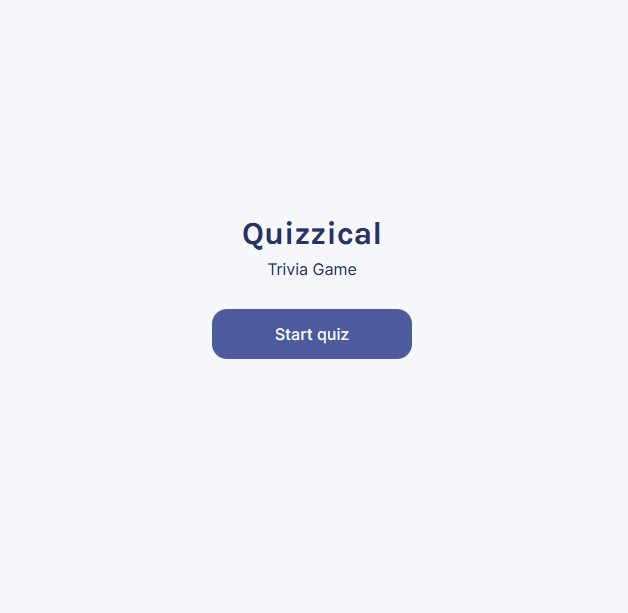
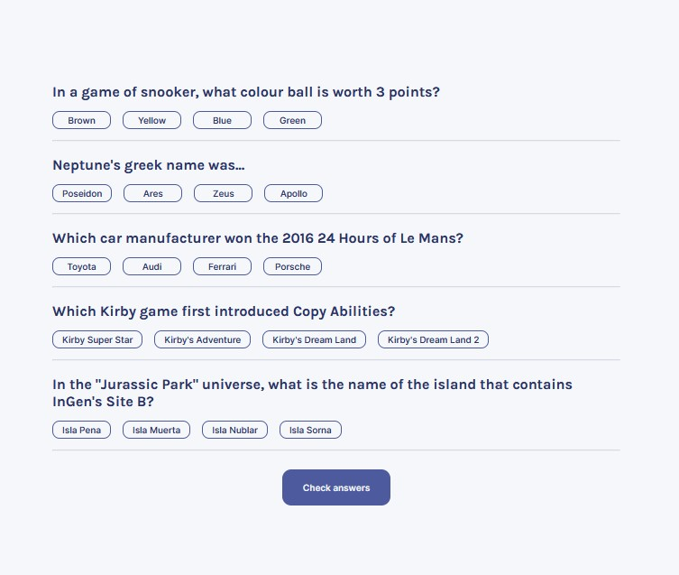
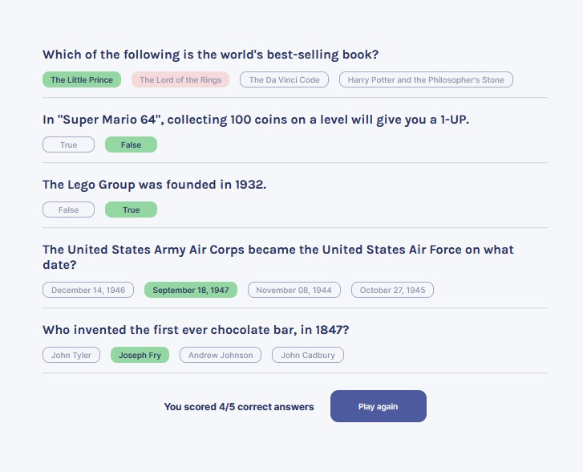

# Quizzical Trivia Game

### Author: Hunter Bernier

## Screenshots of the Game:

### Start Menu

### Quiz Unanswered

### Quiz Answered

## About the Code:

This project was bootstrapped with [Create React App](https://github.com/facebook/create-react-app).

## Available Scripts

In the project directory, you can run:

### `npm start`

Runs the app in the development mode.\
Open [http://localhost:3000](http://localhost:3000) to view it in your browser.

## How the game works:

- Click the "Start Quiz" button on the main menu to start the game
- 5 multiple choice/true or false question will be presented
- Answer the questions by clicking on the answer choice that you think is correct
  - Your selection will be highlighted in blue
- Once you are happy with your answers, hit the "Check answers" button
- It will reveal how many you got correct, change the background of your selections to green, and if you got a question incorrect, the correct answer will be shown in red
- To play another round, click the "Play again" button

## Website for Trivia Question API:

https://opentdb.com/api_config.php
